# 📊 Diagrama de Flujo - Inicio de Aplicación

## Diagrama de Secuencia Detallado

## Diagrama de Flujo de Decisión

```mermaid
flowchart TD
    A[Inicio: main.py ejecutado] --> B[Crear Aplicacion]
    B --> C[Crear tk.Tk - Ventana raíz]
    C --> D[Llamar mostrar_login]
    D --> E[Limpiar widgets existentes]
    E --> F[Crear VentanaLogin]
    F --> G[Crear Autenticacion]
    G --> H[Crear BaseDatos]
    H --> I[Conectar a MySQL]
    I --> J{Conexión exitosa?}
    J -->|No| K[Error: No se puede conectar]
    J -->|Sí| L[Crear widgets de login]
    L --> M[Mostrar ventana de login]
    M --> N[Usuario ingresa credenciales]
    N --> O[Presiona Iniciar Sesión]
    O --> P[Validar campos no vacíos]
    P --> Q{Campos válidos?}
    Q -->|No| R[Mostrar error]
    R --> N
    Q -->|Sí| S[Autenticacion.iniciar_sesion]
    S --> T[Consultar usuario en BD]
    T --> U{Usuario encontrado?}
    U -->|No| V[Retornar None]
    V --> W[Mostrar error de autenticación]
    W --> N
    U -->|Sí| X[Hash de contraseña]
    X --> Y[Comparar contraseñas]
    Y --> Z{Contraseña correcta?}
    Z -->|No| V
    Z -->|Sí| AA[Actualizar último acceso]
    AA --> AB[Guardar usuario_actual]
    AB --> AC[Registrar log de inicio]
    AC --> AD[Callback: on_login_exitoso]
    AD --> AE[Limpiar widgets de login]
    AE --> AF[Crear VentanaPrincipal]
    AF --> AG[Configurar ventana maximizada]
    AG --> AH[Crear widgets principales]
    AH --> AI[Obtener módulos según rol]
    AI --> AJ[Crear botones del menú]
    AJ --> AK[Mostrar primer módulo]
    AK --> AL[Crear VistaEventos]
    AL --> AM[Ejecutar root.mainloop]
    AM --> AN[Aplicación en ejecución]
    AN --> AO{Usuario interactúa?}
    AO -->|Navega módulos| AP[Cambiar vista]
    AP --> AL
    AO -->|Cierra sesión| AQ[Registrar log]
    AQ --> AR[Cerrar sesión]
    AR --> AS[Terminar aplicación]
```

## Diagrama de Clases Simplificado

## Diagrama de Estados

```mermaid
stateDiagram-v2
    [*] --> Iniciando: main.py ejecutado
    Iniciando --> Login: Aplicacion creada
    Login --> Validando: Usuario presiona login
    Validando --> ConsultandoBD: Credenciales válidas
    ConsultandoBD --> Verificando: Usuario encontrado
    Verificando --> Autenticado: Contraseña correcta
    Verificando --> Login: Contraseña incorrecta
    ConsultandoBD --> Login: Usuario no encontrado
    Autenticado --> Principal: Callback ejecutado
    Principal --> CargandoModulo: Widgets creados
    CargandoModulo --> Ejecutando: Módulo cargado
    Ejecutando --> Navegando: Usuario selecciona módulo
    Navegando --> CargandoModulo: Nuevo módulo
    Ejecutando --> Cerrando: Usuario cierra sesión
    Cerrando --> [*]: root.quit()
```

## Tabla de Métodos y Variables por Fase

| Fase | Archivo | Clase | Método | Variables Principales |
|------|---------|-------|--------|----------------------|
| **1. Inicio** | main.py | Aplicacion | `__init__()` | `self.root`, `self.ventana_principal` |
| | main.py | Aplicacion | `mostrar_login()` | - |
| | main.py | Aplicacion | `ejecutar()` | - |
| **2. Login** | vistas/login.py | VentanaLogin | `__init__()` | `self.root`, `self.callback_login_exitoso`, `self.autenticacion` |
| | vistas/login.py | VentanaLogin | `crear_widgets()` | `self.entry_usuario`, `self.entry_contrasena` |
| | vistas/login.py | VentanaLogin | `iniciar_sesion()` | `usuario`, `contrasena`, `usuario_autenticado` |
| **3. Autenticación** | modelos/autenticacion.py | Autenticacion | `__init__()` | `self.base_datos`, `self.usuario_actual` |
| | modelos/autenticacion.py | Autenticacion | `iniciar_sesion()` | `usuario`, `contrasena_hash` |
| | modelos/autenticacion.py | Autenticacion | `hash_contrasena()` | `contrasena` |
| | modelos/base_datos.py | BaseDatos | `__init__()` | `self.conexion` |
| | modelos/base_datos.py | BaseDatos | `conectar()` | - |
| | modelos/base_datos.py | BaseDatos | `obtener_uno()` | `consulta`, `parametros` |
| **4. Callback** | main.py | Aplicacion | `on_login_exitoso()` | `usuario`, `autenticacion` |
| **5. Principal** | vistas/ventana_principal.py | VentanaPrincipal | `__init__()` | `self.usuario`, `self.autenticacion`, `self.vista_actual` |
| | vistas/ventana_principal.py | VentanaPrincipal | `crear_widgets()` | `self.botones_menu`, `self.contenido_frame`, `modulos` |
| | vistas/ventana_principal.py | VentanaPrincipal | `obtener_modulos_disponibles()` | `rol`, `modulos` |
| | vistas/ventana_principal.py | VentanaPrincipal | `mostrar_modulo()` | `clase_vista` |

---

## 🔑 Puntos Clave del Flujo

1. **Separación de Responsabilidades**: Cada clase tiene una responsabilidad específica
2. **Callbacks**: Se usan para comunicación entre componentes
3. **Gestión de Estado**: El usuario autenticado se mantiene en `Autenticacion.usuario_actual`
4. **Limpieza de UI**: Los widgets se destruyen antes de crear nuevos
5. **Carga Dinámica**: Los módulos se cargan según el rol del usuario
6. **Conexión Persistente**: La conexión a MySQL se mantiene durante toda la sesión

---

Este documento complementa `FLUJO_INICIO_APLICACION.md` con diagramas visuales del flujo de inicio.

